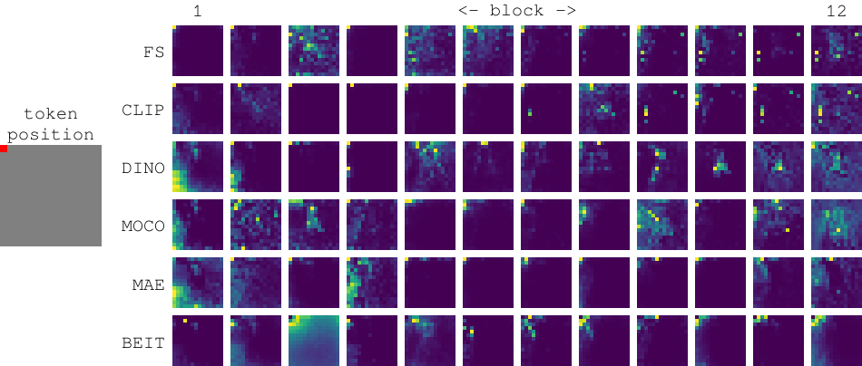

# Teaching Matters: Investigating the Role of Supervision in Vision Transformers (CVPR 2023)



This is the official repository for the work [Teaching Matters: Investigating the Role of Supervision in Vision Transformers](https://openaccess.thecvf.com/content/CVPR2023/html/Walmer_Teaching_Matters_Investigating_the_Role_of_Supervision_in_Vision_Transformers_CVPR_2023_paper.html) accepted to CVPR 2023. It includes scripts and function for analyzing and comparing ViTs trained with different methods of supervision. Also see our [Project Webpage](http://www.cs.umd.edu/~sakshams/vit_analysis/).


## Setup

If using conda environment:
```
conda create --name vit_an python=3.9
conda activate vit_an
```

Install packages:
```
pip install torch==1.11.0+cu113 torchvision==0.12.0+cu113 torchaudio==0.11.0 --extra-index-url https://download.pytorch.org/whl/cu113
pip install matplotlib
pip install opencv-python
pip install pandas
pip install scikit-image
pip install pycocotools
pip install scikit-learn
cd CLIP
pip install -e .
cd ..
cd timm_vit_modified/pytorch-image-models/
pip install -e .
cd ../..
```

Download MAE Models:
```
cd models/mae
wget -nc https://dl.fbaipublicfiles.com/mae/pretrain/mae_pretrain_vit_base.pth
wget -nc https://dl.fbaipublicfiles.com/mae/pretrain/mae_pretrain_vit_large.pth
wget -nc https://dl.fbaipublicfiles.com/mae/pretrain/mae_pretrain_vit_huge.pth
cd ../..
```

Download MoCo-v3 Models:
```
cd moco-v3/weights
bash download_weights.sh
cd ../..
```

Download BEIT Models:
```
cd models/beit
wget https://conversationhub.blob.core.windows.net/beit-share-public/beit/beit_base_patch16_224_pt22k.pth
wget https://conversationhub.blob.core.windows.net/beit-share-public/beit/beit_large_patch16_224_pt22k.pth
cd ../..
```

For TIMM (Fully Supervised), CLIP, and DINO, models are downloaded automatically when called


## Datasets

The following datasets are used in this analysis: ImageNet, ImageNet-50 (sub-sampling of ImageNet), PartImageNet, COCO, ROxford5k, RParis6k, DAVIS, SPair-71k. These datasets should be placed in the data/ folder in the root directory. Alternately, when calling an analysis script you can specify a different path to each dataset using the --dataroot flag.


## Analysis Scripts

This section describes how to use all of the analysis scripts in the repository. Whenever calling an analysis script, you must specify the model args. A list of all valid model args is provided in the subsequent section. For example, a call for attention analysis with model args for DINO B/16 would look like:

```
python run_attention_analysis.py --dataroot {DATA_PATH} --run_exp --run_grids --meta_model dino --arch B --patch 16
```


### Attention Analysis

Run Attention Map Visualizations
```
python run_attention_analysis.py --dataroot {DATA_PATH} --run_exp --run_grids {MODEL_ARGS}
```

Run Attention Distance Metric
```
python run_attention_analysis.py --dataroot {DATA_PATH} --run_met {MODEL_ARGS}
python run_attention_analysis.py --dataroot {DATA_PATH} --run_meta
```

Run Attention Saliency (IoU) Analysis on COCO or PartImageNet
```
python run_seg_analysis.py --dataroot {DATA_PATH} --run_iou --dataset coco --imcount 5000 {MODEL_ARGS}
python run_seg_analysis.py --dataroot {DATA_PATH} --run_iou --dataset pin --persc 500 {MODEL_ARGS}
python run_seg_analysis.py --dataroot {DATA_PATH} --run_meta
```

### Feature Analysis

Between Model CKA (must specify two models)
```
python run_feature_analysis.py --dataroot {DATA_PATH} --meta_model {meta_model} --arch {arch} --patch {patch} --imsize {imsize} --meta_model_2 {meta_model_2} --arch_2 {arch_2} --patch_2 {patch_2} --imsize_2 {imsize_2} --run_cka --output_dir feature_analysis_out
```

Last Layer CKA (must specify two models)
```
python run_feature_analysis.py --dataroot {DATA_PATH} --meta_model {meta_model} --arch {arch} --patch {patch} --imsize {imsize} --meta_model_2 {meta_model_2} --arch_2 {arch_2} --patch_2 {patch_2} --imsize_2 {imsize_2} --last_layer_dump
python run_feature_analysis.py --dataroot {DATA_PATH} --plot_last_layer --only_b16
```

For plots in appendix
```
python run_feature_analysis.py --dataroot {DATA_PATH} --plot_last_layer
```

CLS Token clustering ImageNet-50
```
python run_feature_analysis.py --dataroot {DATA_PATH} --dump_cls {MODEL_ARGS}
```

Spatial Token clustering ImageNet-50
```
python run_feature_analysis.py --dataroot {DATA_PATH} --dump_spat {MODEL_ARGS}
```

Plot both Spatial and CLS token clustering Imagenet-50
```
python run_feature_analysis.py --dataroot {DATA_PATH} --plot_clust --only_b16
```

For plots in appendix
```
python run_feature_analysis.py --dataroot {DATA_PATH} --plot_clust
```

Spatial Token object-level clustering on COCO
```
python run_seg_analysis.py --dataroot {DATA_PATH} --run_feats --dense --dataset coco --imcount 1000 {MODEL_ARGS}
python run_seg_analysis.py --dataroot {DATA_PATH} --run_met --dense --dataset coco --imcount 1000 {MODEL_ARGS}
python run_seg_analysis.py --dataroot {DATA_PATH} --run_meta
```

Run object-level and part-level spatial feature clustering on COCO or PartImageNet
```
python run_seg_analysis.py --dataroot {DATA_PATH} --run_feats --dense --dataset pin --persc 100 {MODEL_ARGS}
python run_seg_analysis.py --dataroot {DATA_PATH} --run_met --dense --dataset pin --persc 100 {MODEL_ARGS}
python run_seg_analysis.py --dataroot {DATA_PATH} --run_meta
```

Residual Connection Analysis
```
python run_feature_analysis.py --dataroot {DATA_PATH} --run_cka_residual {MODEL_ARGS}
```

### Downstream Task Analysis

k-NN Classification (specify feature layer using integer for {blk})
```
python run_downstream_analysis.py --dataroot {DATA_PATH} --run_knn --dataset imagenet --dataroot {PATH TO IMAGENET} --batch 256 --blk {blk} {MODEL_ARGS}
```

Image Retrieval
```
python run_downstream_analysis.py --dataroot {DATA_PATH} --run_retrieval --dataroot {PATH TO DATASET} --dataset rparis6k --batch 1 --blk {blk} {MODEL_ARGS}
python run_downstream_analysis.py --dataroot {DATA_PATH} --run_retrieval --dataroot {PATH TO DATASET} --dataset roxford5k --batch 1 --blk {blk} {MODEL_ARGS}
```

DAVIS Video Object Segmentation.
The first command will export the results to file. For the second command, first download the official DAVIS evaluation script. Follow the same instructions here: https://github.com/facebookresearch/dino#evaluation-davis-2017-video-object-segmentation
```
python run_downstream_analysis.py --dataroot {DATA_PATH} --run_video_segmentation --dataroot {PATH TO DAVIS} --dataset davis --batch 1 --blk {blk} --dense --output_dir davis_dense {MODEL_ARGS} --output_dir all_results/davis_dense
python davis2017-evaluation/evaluation_method.py --task semi-supervised --results_path {PATH TO STEP 1 OUTPUT} --davis_path davis-2017/DAVIS/ 
```

Keypoint Correspondences
```
python run_kp_analysis.py --dataroot {DATA_PATH} --meta_model {meta_model} --arch {arch} --patch {patch} --imsize {imsize} --blk {blk}
```

Plot all Downstream Task Results
```
python collect_evals.py
```

For plots in appendix
```
python collect_all_evals.py
```


## Model Configs

These lists contain all model config used in our analysis. Append these args to any of the analysis scripts above. The default image size is 224.

DINO:
```
--meta_model dino --arch S --patch 16
--meta_model dino --arch S --patch 8
--meta_model dino --arch B --patch 16
--meta_model dino --arch B --patch 8
```

CLIP:
```
--meta_model clip --arch B --patch 32
--meta_model clip --arch B --patch 16
--meta_model clip --arch L --patch 14
```

MAE:
```
--meta_model mae --arch B --patch 16
--meta_model mae --arch L --patch 16
--meta_model mae --arch H --patch 14
```

timm: (fully supervised training)
```
--meta_model timm --arch S --patch 32
--meta_model timm --arch S --patch 16
--meta_model timm --arch B --patch 32
--meta_model timm --arch B --patch 16
--meta_model timm --arch B --patch 8
--meta_model timm --arch L --patch 16
```

MoCo-v3:
```
--meta_model moco --arch S --patch 16
--meta_model moco --arch B --patch 16
```

BEiT:
```
--meta_model beit --arch B --patch 16
--meta_model beit --arch L --patch 16
```


### Additional Models

These are additional valid model options available in the framework

```
--meta_model clip --arch L --patch 14 --imsize 336
--meta_model timm --arch B --patch 16 --imsize 384
--meta_model timm --arch B --patch 32 --imsize 384
--meta_model timm --arch L --patch 16 --imsize 384
--meta_model timm --arch L --patch 32 --imsize 384
```


## Acknowledgments and Modifications

This repository wraps several official codebases for the various ViT training methods examined. These sub-directories are under the respective licenses of their original releases. We here acknowledge the original sources and note the modifications made for our analysis.

DINO: https://github.com/facebookresearch/dino
* dino/vision_transformer.py - added placeholders to get residual analysis outputs

CLIP: https://github.com/openai/CLIP
* CLIP/clip/model.py - added placeholders to get attention weights
* added placeholders to get residual analysis outputs

MAE: https://github.com/facebookresearch/mae
* mae/models_mae.py - added an option to forward pass to disable token shuffle and masking for inference
* Modified code so that all of the sub modules can run with same version of pytorch and timm

timm (pytorch-image-models): https://github.com/rwightman/pytorch-image-models
* added placeholders to get residual analysis outputs (to vision_transformer.py)

MoCo: https://github.com/facebookresearch/moco-v3
* directly interfaces with changes made to timm

BEiT: https://github.com/microsoft/unilm/blob/master/beit
* directly interfaces with changes made to timm

CKA Code: https://github.com/AntixK/PyTorch-Model-Compare


## License

Distributed under the MIT License.

## Citation

If you found our work useful, please consider citing our paper:

```
@inproceedings{walmer2023teaching,
  title={Teaching Matters: Investigating the Role of Supervision in Vision Transformers},
  author={Walmer, Matthew and Suri, Saksham and Gupta, Kamal and Shrivastava, Abhinav},
  booktitle={Proceedings of the IEEE/CVF Conference on Computer Vision and Pattern Recognition},
  pages={7486--7496},
  year={2023}
}
```
